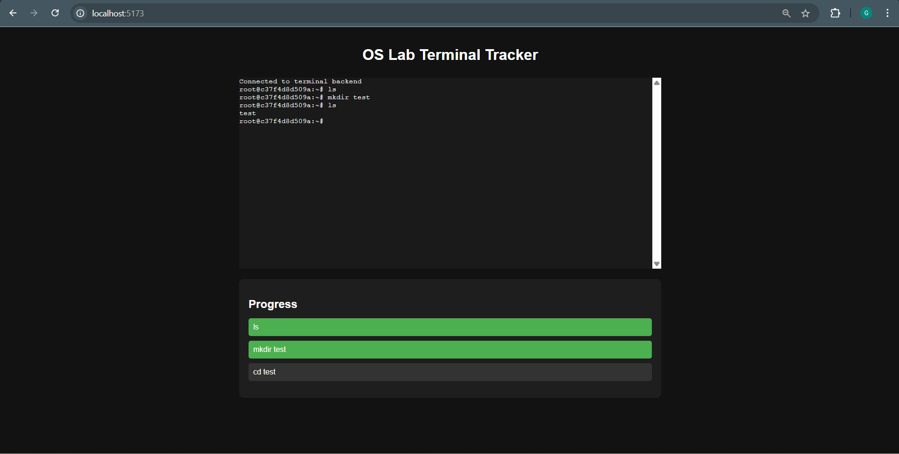

# Terminal Command Tracking App

Track terminal commands in real-time via a web-based frontend. Perfect for OS lab exercises, tutorials, or interactive learning environments.

---

## 📦 Prerequisites

Make sure you have the following installed:

- [Docker](https://www.docker.com/get-started)
- [Node.js](https://nodejs.org/)

---

##  Getting Started

### 1️⃣ Clone the Repository

```bash
git clone https://github.com/ganeshsprofessional/terminal-command-tracking.git
cd terminal-command-tracking
```

---

### 2️⃣ Start the Backend (Docker)

In the project root:

```bash
docker-compose up --build
```

This builds and launches the backend (e.g., `ttyd` shell service).

---

### 3️⃣ Start the Frontend (React)

```bash
cd frontend
npm install
npm run dev
```

Open your browser at:

```
http://localhost:5173/
```

---

## ▶️ How It Works

- A separate node environment with node-pty is spawned upon the docker build and backend code is executed in the container.
- With port forwarding, the frontend communicates with the backend in the container
- The websocket server runs the commands in real time and emits the output to frontend
- React frontend shows a terminal UI and listens for user commands.
- Tracked commands (`ls`, `mkdir test`, `cd test`) are matched and stored in progress state.
- UI updates in real-time to reflect user progress.

---

## 📁 Project Structure

```
terminal-command-tracking/
├── frontend/
│   ├── components/
│   ├── App.jsx
│   └── ...
├── docker-compose.yml
└── README.md
```

---

## ✅ Tracked Commands

These commands are monitored and marked as completed in the UI:

- `ls`
- `mkdir test`
- `cd test`

---

## 📷 Screenshot




---

